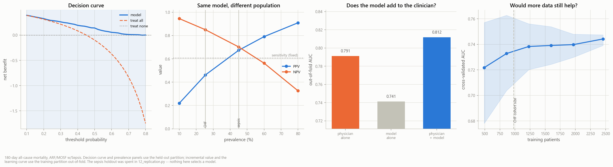

# Predicting Death Risk in Critically Ill Patients

**What a prediction model built from routine hospital data can and cannot do**

| | |
|---|---|
| **Prepared by** | Matthew Moxam |
| **Data** | SUPPORT2 — 9,105 seriously ill hospitalised adults, 5 US academic medical centres, 1989–1994 |
| **Cohorts analysed** | Heart failure (n=1,387) and ICU sepsis (n=3,515) |
| **Status** | Complete. Both held-out samples spent once. 61 questions, 14 analysis scripts, 98 automated tests. |

---

## The finding

**A model built from 28 routine admission measurements does not beat an experienced
clinician — and still makes one measurably better.**

Given the same patients, the attending physician's own estimate of survival predicts
death better than the model does. But a clinician *combined with* the model predicts
better than either alone, by a margin that is statistically solid rather than
suggestive. The model earns its place as a second opinion, not a replacement.

It also passes the test most prediction models quietly skip: whether acting on it
beats current practice. Across essentially every risk threshold a clinician might
use, it does — worth roughly **19 fewer unnecessary interventions per 100 patients**
at no cost in deaths missed.

*Left to right: acting on the model beats treating everyone and treating nobody across
the usable range; the same model's predictive value changes with the population it is
applied to; the clinician plus the model beats the clinician alone; and the benefit of
collecting more patients has largely flattened.*

---

## The three numbers that matter

| | Result | What it means |
|---|---|---|
| **Clinician + model vs clinician alone** | **+0.021** [+0.010, +0.031] | The model adds real information. The range excludes zero, so this is not noise. |
| **Unnecessary interventions avoided** | **19 per 100 patients** | At the same number of deaths correctly identified, versus treating everyone. |
| **Model vs clinician, head to head** | 0.735 vs **0.767** | The clinician wins alone. Expected — they examined the patient; the model saw a spreadsheet row. |

---

## What we would do next

| Priority | Action | Why |
|---|---|---|
| **1** | Collect better variables, not more patients | Doubling the sample buys ~0.015; the missing measurements (lactate, cultures, antibiotic timing; ejection fraction for cardiac patients) are where the headroom is. |
| **2** | Recalibrate before any new deployment | The same model yields 46% precision in one population and 67% in another. This is arithmetic, not tuning, and it is cheap. |
| **3** | Validate externally before clinical use | Everything here is internal to one 1990s research programme. |
| **Do not** | Spend further effort on algorithms | Five model families land within 0.05 of one another; a ten-fold larger search moved nothing. The limit is the data, not the method. |

---

## The caveat, stated plainly

**This is not a deployable product, and three findings say so.** The cohort closed in
1994, before most modern therapy. Neither model was validated outside the hospitals
that produced it. And the heart failure arm was too small to support the confidence
its own numbers imply — which is precisely why a second, larger cohort was added and
every conclusion re-tested against it.

Two claims from the original analysis did **not** survive that re-test, and both are
reported here rather than dropped. That is the point of the exercise: a study that
reports only what worked has not been validated, it has been curated.

---

## Reading the technical terms

| Term | Plain meaning |
|---|---|
| **AUC** | Chance the model ranks a patient who died above one who lived. 0.5 = coin flip, 1.0 = perfect. Clinical models typically land 0.65–0.80. |
| **Calibration** | Whether "30% risk" actually means 30% die. A model can rank patients correctly and still state the wrong numbers. |
| **Decision curve / net benefit** | Whether *acting* on the model beats current practice, given that a missed death and an unnecessary treatment cost different amounts. |
| **Precision (PPV) / NPV** | Of those flagged high-risk, how many die; and of those flagged low-risk, how many live. Both shift with how common death is in the population. |
| **Held-out sample** | A slice of patients quarantined before any modelling and examined exactly once, so the final number cannot be tuned toward. |
| **Events per variable** | Deaths available per quantity estimated. Below ~10 the model is fitting noise as much as signal. |

---
---

# Technical Appendix

*Everything below is the detailed methodology and full results. The summary above is
drawn from it; nothing here contradicts it.*

---

## What the second cohort settled

The heart failure arm was underpowered by design — 978 patients against Riley's
requirement of 2,465. Three of its conclusions were re-tested at 4.4× the events.

**Machine learning still does not beat regression — and now precisely.** Pre-specified
before either holdout was read. Comparing like with like, both on held-out patients:
in heart failure XGBoost minus elastic net was −0.0072 [−0.0554, +0.0427] — consistent
with no difference, but far too wide to be evidence of one. In sepsis it is
**−0.0024 [−0.0171, +0.0121]**, under a third the width. The same comparison
cross-validated on the training partition gives +0.0038 [−0.0061, +0.0133]. The finding
moved from "we cannot tell" to "equivalent to within about ±0.013", which is a genuine
null rather than an absence of power. Consistent with the literature
(Christodoulou et al., *J Clin Epidemiol* 2019).

**Calibration recovered, confirming the diagnosis.** The heart failure model's
calibration failed on held-out patients (slope 0.706; predicted 26.0% against observed
30.8%). The cause was traced to our own design defect — stratifying the split on
all-cause death over full follow-up while modelling 180-day mortality in a subgroup,
which left a 5.4-point prevalence gap between partitions. In sepsis the same defect
exists but the gap is **0.6 points**, and calibration is near-perfect (slope 0.957,
predicted 44.1% against observed 45.0%). The failure was a sample artefact, as
diagnosed, rather than a modelling error.

**The physician result replicated, and resolved.** The model lost to the attending
physician on held-out patients in *both* cohorts. Two independent estimates agreeing
in direction is stronger evidence than either interval alone: clinical judgement is
probably genuinely the better single predictor, and the development-stage result that
favoured the model was optimism. That is settled — and the incremental-value analysis
above shows why it does not end the case for the model.

**One finding did NOT replicate, and is reported as such.** In heart failure, a
do-not-resuscitate directive brought from home was statistically indistinguishable from
no directive (log-rank p=0.882) while one written during the admission nearly doubled
mortality — the contrast that argued DNR records a *care decision*, not illness
severity. In sepsis the pre-existing directive carries a 50-point mortality gap
(p<0.001). The heart failure version was probably underpowered. The decision it drove —
excluding in-admission DNR as a self-fulfilling predictor — never depended on it and
still stands.

---

## More data, more tuning, or better variables?

Answered with evidence rather than assertion, three independent ways:

| Lever | Test | Result |
|---|---|---|
| Bigger hyperparameter search | 24 → 250 configurations, nested CV | **−0.004 AUC** |
| | XGBoost 1 → 120 configurations, 9 hyperparameters | **+0.004 AUC** |
| Different model family | five families, unpenalised to gradient boosting | all within 0.05 |
| More patients | learning curve, doubling the sepsis cohort | **+0.015**, flattening |

Five model families landing within 0.05 AUC of one another, an optimism-bootstrap
shrinkage factor of 1.00, and a ten-fold larger grid moving nothing all point the same
way: **the limit is the information in these 28 variables, not the algorithm.** The only
lever with real headroom is measuring something the dataset never recorded — lactate,
cultures, antibiotic timing, vasopressors; and for the heart failure arm, ejection
fraction.

---

## The most transferable finding

Six variables appeared informatively missing on a conventional chi-square test, with
mortality gaps of 10–20 points at p<0.001. **Half were artefacts.**

Patients missing BUN were followed a median 1,690 days against 664 — 2.55× longer. More
had died by study close because they were *watched longer*, not because they died
faster. A log-rank test on the same split is null.

The mechanism was proven rather than hypothesised: censoring times are bimodal with an
empty interval at ~1,150 days — two enrolment waves closed on one date. **BUN, urine and
glucose are 100.0% missing in the early wave against 0.9–9.1% in the late one.**

**It then replicated in the sepsis cohort**, in different patients with a different
illness and a different mortality rate — and the replication produced a cleaner
diagnostic than the original. Accounting for exposure time shrinks the artefactual
associations by 7–12×, while the two genuinely-missing control variables *grow*
stronger. An artefact loses an order of magnitude when you account for observation
time; a real effect gains.

*A cumulative-outcome test cannot see exposure time. Whenever a group difference in a
cumulative outcome is the headline, check whether the groups were observed for equally
long before believing it.*

**The corollary, tested directly:** relaxing the 180-day horizon to "died at any point"
recovers a third more events and raises AUC by +0.007 — and imports the enrolment
calendar into the label. The between-wave mortality gap doubles from 5.0 to 10.6 points,
and a flag encoding nothing but "BUN was not recorded" predicts the relaxed outcome at
AUC 0.554 against 0.525 for the fixed horizon. Worse, the contamination cannot be
engineered away: with those three columns removed entirely, ordinary clinical variables
still identify the enrolment wave at **AUC 0.641**. The remedy is a horizon every
patient was observed through, not feature selection.

---

## Method integrity

| Safeguard | Implementation |
|---|---|
| Held-out partitions | 30% per cohort, seeded, **read exactly once**, behind a separately named function no other script calls |
| Cohort selection | Split computed on the whole dataset before subsetting — a test asserts a patient's assignment cannot change with the cohort requested |
| Imputation | MICE refitted **inside every CV fold**; a test asserts the fitted state differs per fold |
| Model selection | Nested CV — every hyperparameter search sits inside the pipeline |
| Multiplicity | Benjamini–Hochberg across all multi-variable tables |
| Reporting standard | TRIPOD+AI: calibration reported alongside discrimination throughout |
| Reproducibility | Dependencies pinned exactly; golden-value tests pin every published number so a dependency change breaks the build |

Every quantitative claim in this repository is interpolated from a run rather than
typed. Full console transcripts are committed under [`output/`](output/).

**Findings this discipline killed during development**, all of which looked real first:
education-related missingness (p=0.004 unadjusted → q=0.253 corrected), heart-rate
non-linearity (p=0.021 → q=0.093), and a stated prediction about the learning curve that
the data contradicted and which is recorded as wrong rather than rewritten.

---

## What may not be claimed

- **Not a deployable score.** The heart failure arm is underpowered by Riley's criteria;
  its coefficients carry more uncertainty than their intervals suggest.
- **No new model can be adopted from here.** Both holdouts are spent. Any further
  optimisation would be unvalidated by construction, and this dataset has no fresh
  partition left to give.
- **Absolute risks do not transfer to modern practice.** The cohort closed in 1994 —
  before beta-blockers in HFrEF, spironolactone, ICD/CRT, ARNIs, SGLT2 inhibitors, and
  the Surviving Sepsis Campaign bundles. Discrimination may travel; calibration will not.
- **Predictive values do not transfer between populations.** Sensitivity and specificity
  are properties of the model; PPV and NPV are properties of the model *and* the
  prevalence. The same operating point yields PPV 0.462 at 25% prevalence and 0.673 at
  45%. Recalibration to local prevalence is a precondition, not tuning.
- **No HFrEF/HFpEF claim is possible.** No ejection fraction, NYHA class, BNP, ECG,
  medications, revascularisation history, or cause of death.
- **The sepsis arm is not a sepsis study.** No lactate, cultures, antibiotic timing,
  vasopressors or fluids. It was used for its statistical properties; the clinical
  interpretation is correspondingly thinner.
- **Internal validation only.** Both cohorts come from the same five hospitals in the
  same programme. Replicating across disease groups strengthens the *methods* findings
  and says nothing about whether either model would work in a modern hospital.

---

## Honest one-line summary

**A methods study on a historical cohort that produces a defensible internal estimate,
a clear negative result about model complexity that a second cohort sharpened rather
than overturned, and a model that adds measurably to clinical judgement without
replacing it. It is not a product.**

---

*Data: SUPPORT2, UCI Machine Learning Repository [dataset 880](https://archive.ics.uci.edu/dataset/880/support2).
Harrell, F. (1995). No patient-level data is committed to this repository.
Full methodology: [README.md](README.md) — 61 questions across 14 analysis scripts.*
