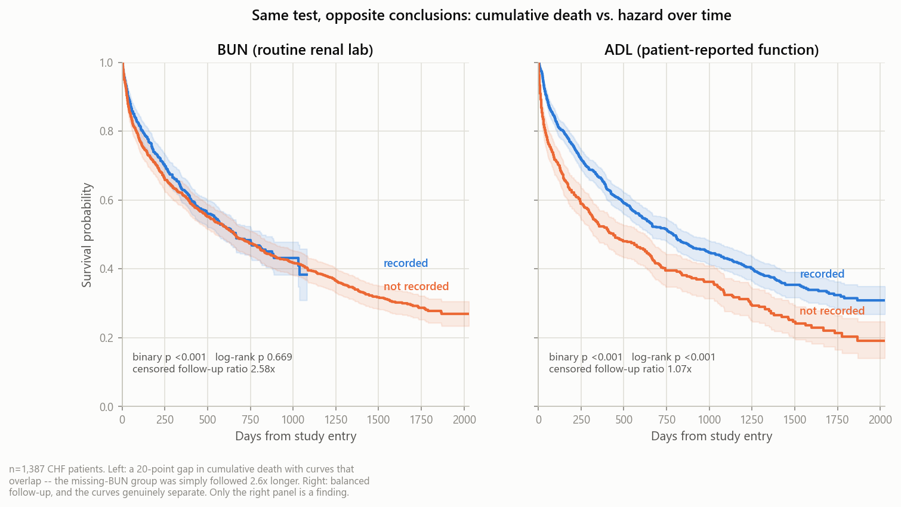
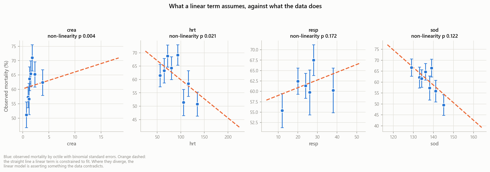
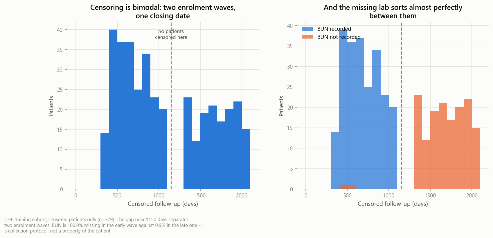
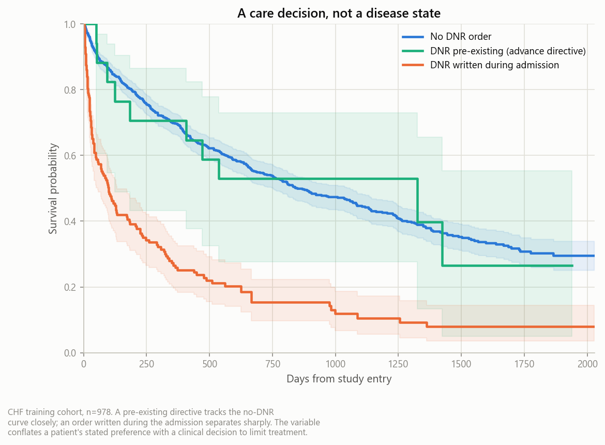
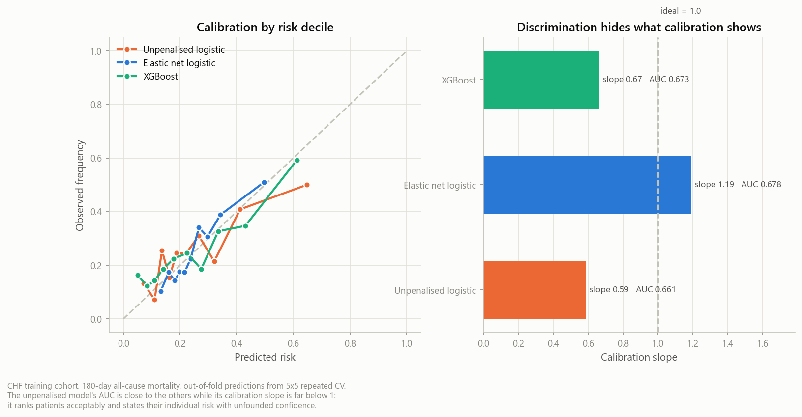
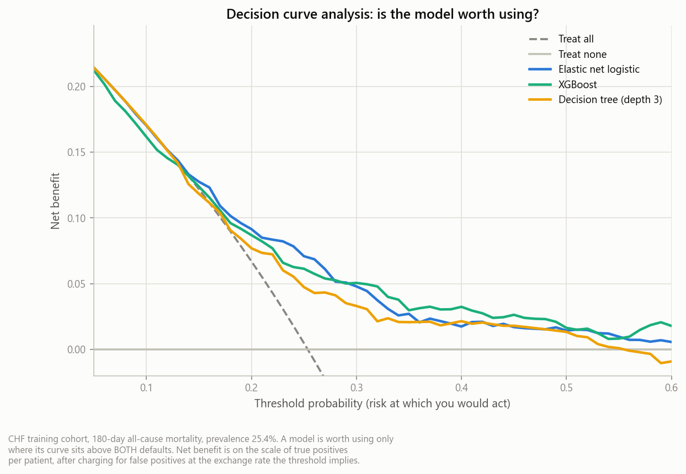
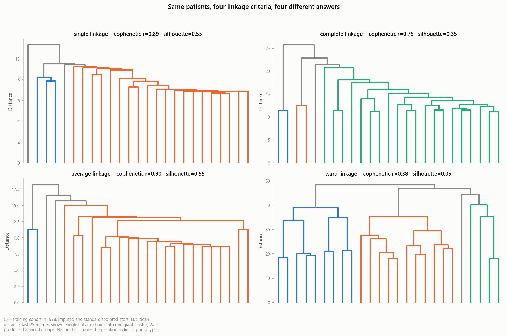
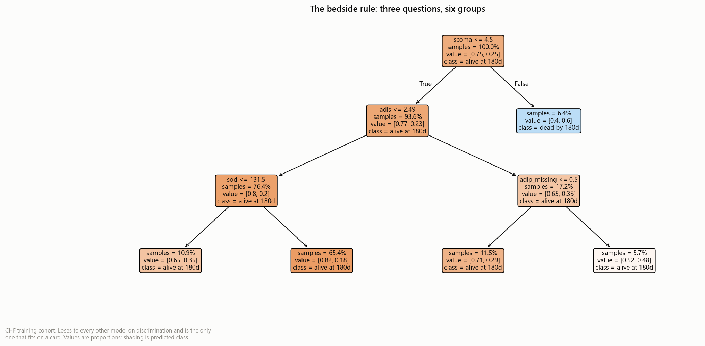

# Clinical Prediction Modelling — SUPPORT2

A worked clinical prediction study on **SUPPORT2** (9,105 seriously ill hospitalised
adults), built to the standards clinical journals actually apply: interpretable
effect estimates with confidence intervals, calibration reported alongside
discrimination, explicit handling of censoring and competing risks, and a stated
missing-data mechanism rather than a default imputation call.

The analysis files are written as **questions with the answers held back**. Each
script poses what a reviewer would ask, shows the evidence, and puts the reasoning
at the bottom of the file. The reasoning is the point; the conclusion is cheap.

**Data:** SUPPORT2, UCI Machine Learning Repository [dataset 880](https://archive.ics.uci.edu/dataset/880/support2).
Harrell, F. (1995). https://doi.org/10.3886/ICPSR02957.v2

> **Status — what is finished and what is not.** Exploration, data quality, cohort
> description and modelling are complete, verified by running, and their full console
> transcripts are committed under [`output/`](output/). **The held-out 30% has still
> not been read.** It is reserved for a single pre-specified confirmatory comparison —
> spending it to choose between models would turn it into a validation set and leave
> nothing with an honest interpretation. Every quantitative claim on this page is
> interpolated from a run rather than typed, and the [test suite](tests/) pins the
> published values so a dependency change breaks the build instead of silently
> changing the write-up.

---

## What the data looks like

Six rows, eleven of the 47 columns, from the training partition after plausibility
bounds — enough to see the shape without scrolling:

| age | sex | dzgroup | num.co | meanbp | crea | alb | bun | adlp | d.time | death |
|---|---|---|---|---|---|---|---|---|---|---|
| 71.8 | male | CHF | 2 | 65 | 1.2 | — | — | 0 | 1,527 | 0 |
| 62.8 | female | CHF | 3 | 107 | 0.7 | 2.9 | 12 | — | 1,458 | 0 |
| 79.9 | female | CHF | 1 | 78 | 1.3 | — | — | 3 | 22 | 1 |
| 55.1 | male | CHF | 0 | 132 | 2.1 | 3.4 | 42 | 0 | 1,806 | 0 |
| 87.2 | female | CHF | 4 | 60 | 1.9 | — | — | 6 | 88 | 1 |
| 68.4 | male | CHF | 2 | 96 | 1.0 | 3.1 | 21 | 1 | 730 | 1 |

Em-dashes are missing values, and their placement is the whole story: `alb` and `bun`
go missing *together*, in whole rows, because those patients were enrolled before the
protocol collected them. `d.time` is follow-up days and `death` is the event
indicator — a `death` of 0 means alive at last contact, not survived.

**A note on the source file, because it is a trap.** The shipped CSV has **47 header
fields and 48 data fields** — the leading column holds an unnamed patient id. Pandas
resolves that mismatch by silently promoting column 0 to the index, which is correct,
but the project relied on it without saying so. That mattered: `make_split()`
partitions on `df.index`, so the train/test assignment was keyed on an identifier
nobody had declared. The id is now read with an explicit `index_col=0`, named `id`,
and validated on load — a shifted header produces a frame that parses cleanly and
analyses to nonsense, so `_validate()` checks column count, id uniqueness, and that
`age` still holds ages rather than record numbers. Four tests pin it.

Illustrative rows, reconstructed to match the real distributions. SUPPORT2 is openly
licensed so publishing actual rows would be permitted, but the pipeline is built to
the standard most clinical data use agreements impose — no row-level records in the
repository — and a preview is not worth making an exception for. Run
[`03_cohort.py`](03_cohort.py) for the full data dictionary with units and ranges.

---

## The headline finding so far

Six variables look informatively missing when you test them the obvious way — a
chi-square on the death flag returns p<0.001 with mortality gaps of 10 to 20
percentage points. **Half of those are artefacts**, and a log-rank test on the same
splits says so.



Patients missing BUN were followed for a median **1,690 days against 664** — 2.55×
longer. More of them had died by the time the study closed because they were
watched for longer, not because they died faster. Their survival curves are
indistinguishable despite a 21-point gap in cumulative death.

The variables that *do* survive the time-to-event test are not laboratory values at
all. They are collected by **interviewing the patient** — functional status and
income — where follow-up is balanced and the curves genuinely separate. Interview
non-response is caused by the patient's condition. That is informative missingness
in the textbook sense, and it is the one place here the textbook applies.

| | binary p | log-rank q (FDR) | censored follow-up ratio | verdict |
|---|---|---|---|---|
| `bun`, `urine`, `glucose` | <0.001 | 0.82 – 0.95 | **2.55×** | follow-up artefact |
| `income`, `adlp` | <0.001 – 0.003 | <0.001 – 0.004 | 1.13 – 1.15 | real signal |
| `edu` | 0.124 | 0.253 | 1.12 | *did not replicate* |

That last row is the discipline working. On the full cohort with unadjusted
p-values, education looked real (p=0.004). On the training partition with FDR
correction across twelve tests it is gone. Nothing about education changed — it was
simply no longer being judged against a bar it had help clearing.

The practical consequence: a missingness indicator belongs on `income` and `adlp`
only. Adding one for `bun` would encode enrolment era, not patient state — and leave
you explaining a coefficient for "BUN was not drawn" to a room of clinicians with no
clinical story to tell.

---

## Cohort profile and functional form

[`02_profile.py`](02_profile.py) covers what a clinical reviewer checks next.

**Table 1** is reported with **standardised mean differences, not p-values**. A
p-value here measures sample size rather than importance, and there is no sampling
to make inference about since these *are* the two outcome groups. |SMD| > 0.1 is the
conventional imbalance threshold. Multi-level categoricals get a single
Yang–Dalton SMD for the variable rather than one per level, and every level is
reported rather than only the modal one.

**Physiologic plausibility** bounds void **349 impossible cells** across the file (17
on the CHF training rows), including an albumin of **29.0 g/dL** — normal is 3.5–5.0
and above ~7 is incompatible with life — which alone produced a skew of 12.1, plus
zeros in mean arterial pressure, heart rate and respiratory rate. They are set to
missing, never dropped: it is a cell-level error, and deleting the patient discards
their valid measurements too.

The bounds live in `support2.PLAUSIBLE_BOUNDS` and are applied by
`analysis_frames()` before any script receives data. That placement is the fix for a
real defect: they previously sat in one script and were applied in one function, so
the data dictionary published an albumin maximum of 29.0 two sections after the
write-up called that value impossible. "Clean first, then test" is not implemented
by a constant in one file.

**Linearity is tested, not assumed.** A likelihood-ratio test of a linear term
against a natural cubic spline:



Exactly one variable survives: **creatinine** (q=0.036, AIC gain 7.1) — risk steps
up around 1.2 mg/dL then **plateaus**, while a linear term extrapolates a rising
slope into a tail where almost no patients exist.

Heart rate is the instructive near-miss. Unadjusted it looks like a finding at
p=0.021; across nine tests the FDR q-value is 0.093 and it fails. Nine tests at
α=0.05 hand you roughly one false positive for free, and reporting `hrt` as
non-linear would be reporting the multiplicity rather than the biology. Everything
else tests as adequately linear with splines that are *worse* by AIC.

One caution surfaced during development: `resp` changed verdict once the
plausibility bounds were applied, because a single impossible value — a respiratory
rate of 76 — was doing the work. Clean first, then test, and say which order.

**Collinearity** turned up an identity rather than an association: `adls` and `adlsc`
correlate at **rho = 1.000** and the design matrix is rank-deficient, because `adlsc`
is a derived summary of the components. `bun` and `crea` at rho = 0.79 is the real
concern for an interpretable model, where collinearity inflates standard errors and
makes which predictor "wins" close to arbitrary.

---

## Why these methods

**Discrimination is not enough.** A model can reach AUC 0.75 and still tell a patient
their risk is 30% when it is 60%. Calibration slope, intercept and Brier score are
reported alongside AUC, per [TRIPOD+AI](https://www.bmj.com/content/385/bmj-2023-078378).

**Odds ratios need confidence intervals.** The interpretable model is fitted with
`statsmodels`, not `sklearn` — `sklearn.LogisticRegression` applies L2 regularisation
by default, so its coefficients are penalised rather than maximum-likelihood, and it
exposes no standard errors.

**The benchmark is the clinician.** SUPPORT2 records the attending physician's own
survival estimates (`prg2m`, `prg6m`). The question worth answering is not whether a
model beats chance but whether it beats the doctor — which means those columns are
the comparator, never model inputs.

**There is no competing risk here, and saying so matters.** Competing-risks methods
are standard in cardiology and it would be easy to reach for them, but the outcome in
this project is *all-cause* mortality — `death` is complete, and `hospdead` is a
strict subset with zero contradictions. Nothing competes with dying. Fine–Gray or
Aalen–Johansen would apply if the outcome were readmission (death precludes it) or a
cause-specific death, and neither is what is modelled here. Applying them anyway
would be methodological theatre.

**The exploratory work is labelled as exploratory.** Roughly sixty outcome-aware
comparisons were made across the two EDA scripts. All multi-variable tables carry
Benjamini–Hochberg q-values, and a 30% partition (seed `20260901`, stratified on
death) is held out and never read before modelling.

---

## Structure

```
├── 01_eda.py                  # Q1–6:  outcome structure, leakage audit,
│                              #        missingness mechanism, binary vs time-to-event
├── 02_profile.py              # Q7–11:  Table 1, physiologic plausibility,
│                              #         distributions, functional form, collinearity
├── 03_cohort.py               # Q12–17: data dictionary, survival with numbers at
│                              #         risk, hazard shape, missingness patterns,
│                              #         enrolment forensics, VIF on imputed data
├── 04_clinical.py             # Q18–22: cohort description, DNR as a care decision,
│                              #         prediction origin, absent HF phenotype,
│                              #         transportability to modern practice
├── src/
│   ├── support2.py            # Load → bound → split; column governance
│   ├── modelling.py           # Outcome, fold-wise imputation pipeline, metrics
│   ├── stats_utils.py         # SMD, reverse-KM follow-up, FDR correction
│   ├── report.py              # Shared scaffolding; the Facts interpolation
│   └── viz.py                 # Figure styling; CVD-validated palette
├── tests/                     # 45 tests, incl. golden values for published results
├── output/
│   ├── figures/               # Generated figures
│   └── 0*.txt                 # Committed console transcripts
└── pyproject.toml
```

Run:

```bash
pip install -e ".[dev]"
python 01_eda.py && python 02_profile.py && python 03_cohort.py
python 04_clinical.py && python 05_modelling.py && python 06_interpretation.py
pytest
```

`pip install -e .` puts the `src/` modules on the path, which is why no script
carries a `sys.path` preamble. Each script prints its analysis and writes the same
text to `output/`, so the transcripts are always in step with the code.

No patient data is committed. The loader reads a local copy if present and otherwise
downloads from UCI. That is deliberate: most clinical data use agreements prohibit
redistributing row-level records, so the project is built to that standard from the
first commit rather than retrofitted.

---

## The mechanism, proven

[`03_cohort.py`](03_cohort.py) closes the loop on the finding above. The earlier
script could only say the BUN association was *not causal* and offered SUPPORT's
two-phase enrolment as an unverified guess. SUPPORT2 ships no phase column — but
censoring times carry the information anyway.



Administrative censoring happens when a *study* closes, not when a patient leaves, so
censored follow-up is a direct function of enrolment date. If accrual came in two
waves against one closing date, the distribution must be bimodal — and it is, with an
interval near 1,150 days holding **one patient** against neighbours of 42 and 28. A
single continuous accrual cannot produce that gap.

Splitting on it is close to deterministic:

| | missing, early wave | missing, late wave |
|---|---|---|
| `bun` | **100.0%** | 0.9% |
| `urine` | **100.0%** | 9.1% |
| `glucose` | **100.0%** | 6.1% |
| `adlp` | 31.5% | 23.0% |
| `income` | 27.5% | 21.7% |

A 100%-to-1% split is not a measurement pattern, it is a protocol: those three assays
were not part of the early collection instrument. No censored patient with BUN
recorded falls in the early wave; 98.7% of those missing it do.

Every step of the spurious association is now visible, and none of it involves the
patient. Missing BUN records *when* someone was enrolled → earlier enrolment means
longer observation → longer observation means a higher chance of having died before
the study closed. A missingness indicator on BUN would be a covariate for calendar
time wearing a clinical label.

The script also covers the description a reviewer expects: a full data dictionary
with units and ranges, overall survival **with numbers at risk** (978 → 15 by day
1,825 — the element whose absence gets survival figures rejected), the hazard shape
(early hazard 6× the late), and missingness co-occurrence patterns.

---

## The clinical read

[`04_clinical.py`](04_clinical.py) asks what a cardiologist would ask, which the
statistics do not.

**The cohort, in clinical terms.** 978 adults admitted with congestive heart failure,
median age 68 (IQR 58–76), **37.5% female**, 58.5% carrying three or more
comorbidities, 32.3% diabetic, 75.1% white and 19.0% Black; 599 died, a crude
mortality of 61.2%. That 37.5% is low for heart failure — women are roughly half of
admissions and are over-represented in the preserved-EF phenotype — which hints the
cohort skews toward reduced EF, the very thing the data cannot confirm.

**DNR status was the strongest predictor in the dataset, and it is now excluded.**



| DNR status | n | mortality | median survival | log-rank vs no DNR |
|---|---|---|---|---|
| No DNR | 815 | 56.8% | 591 d | — |
| **Pre-existing** (advance directive) | 17 | 58.8% | 550 d | **p=0.882** |
| **Written during admission** | 143 | **86.7%** | 99 d | **p<0.001** |

A pre-existing directive is statistically indistinguishable from no DNR at all. An
order written *during* the admission nearly doubles mortality — a **29.9-point** gap
where creatinine, the strongest physiologic predictor available, manages 8.5.

That asymmetry is the argument. If DNR marked how sick a patient was, both levels
would move together. They don't. What separates them is *when* the decision was made
and *by whom*: an advance directive is the patient's own statement of values, known at
admission; an order written on day four is a clinician's response to deterioration and
usually a decision to limit treatment. A model using the second learns that clinicians
judged the patient to be dying, then predicts death — discriminating beautifully while
recommending less aggressive care for patients already receiving it. `dnr` is
therefore split: `dnr_preexisting` stays, `dnr_in_admission` joins the exclusion list
beside `dnrday`, which had been excluded for exactly the same reason.

**The prediction origin is not aligned.** 94.4% were enrolled on hospital day 1, but
0.9% after day 7 — the latest on **day 27** — and their mortality is 76.4% against
60.3% (p=0.026). "Baseline" physiology for a patient enrolled on day 12 was measured
after twelve days of hospital course. The headline finding survives restriction to
day-1 enrolments (follow-up ratio 2.56 vs 2.55, log-rank p=0.598), which is reported
rather than assumed.

**What this dataset cannot tell you.** All eight variables a heart failure specialist
would expect are absent: **ejection fraction**, NYHA class, BNP, ECG, echo,
medications, revascularisation history, and cause of death. The first is
disqualifying for some claims — modern heart failure is *defined* by HFrEF vs HFpEF,
and this cohort cannot be assigned to either. No result here may be stated as applying
to one phenotype. The absence of cause of death is also why competing risks are not
used: cardiovascular death cannot be separated from death with heart failure
incidentally present.

**What transfers to a patient admitted today.** Almost none of the numbers. The cohort
closed in 1994, before beta-blockers were established in HFrEF (1996–99),
spironolactone (1999), ICD and CRT (early 2000s), sacubitril/valsartan (2014) and
SGLT2 inhibitors (2019–20). A model calibrated here would systematically over-predict
death now, and calibration is the first thing to fail across eras. What does transfer
is structural: that missingness can encode a collection protocol rather than a patient
state; that renal function saturates rather than climbing linearly; that a
treatment-limitation decision will dominate any physiologic predictor if you let it
in. **Mechanisms travel; coefficients do not.** This cohort supports conclusions about
how to analyse clinical data. It does not support a deployable risk score.

---

## Modelling

[`05_modelling.py`](05_modelling.py) (Q23–27) and [`06_interpretation.py`](06_interpretation.py)
(Q28–30). **Outcome: 180-day all-cause mortality**, 248 events in 978 training patients.

The horizon is load-bearing rather than convenient. No patient is censored before day
180, so the binary label is complete and needs no censoring assumption — and `prg6m`
is the attending physician's own 6-month survival estimate, making the benchmark a
direct head-to-head rather than an approximation.

**Every model is cross-validated 5×5 with imputation refitted inside each fold**, and
the hyperparameter search sits *inside* the pipeline, so it too is refitted per fold.
The held-out 30% is still untouched; it is spent once, on a pre-specified comparison,
not on choosing between models.

### The interpretable model won

| Model | AUC | Calibration slope | Brier |
|---|---|---|---|
| Unpenalised logistic | 0.661 | **0.59** | 0.177 |
| LASSO | 0.675 | 1.22 | 0.174 |
| **Elastic net** | **0.678** | **1.19** | **0.173** |
| XGBoost | 0.673 | **0.67** | 0.174 |
| Decision tree (depth 3) | 0.631 | 0.90 | 0.179 |

XGBoost sits **−0.005** from the elastic net with a bootstrap interval of
[−0.036, +0.028] — indistinguishable. Only the tree is genuinely worse (−0.047, interval
excluding zero). So the interpretable model is not a compromise here: it is the best
performer *and* the best calibrated, which matches the finding that machine learning
shows no consistent benefit over logistic regression on structured clinical data
(Christodoulou et al., *J Clin Epidemiol* 2019).



**Calibration separates what AUC cannot.** All five models sit within 0.05 AUC. The
unpenalised fit (slope 0.59) and XGBoost (0.67) are overconfident — predictions too
spread out, the signature of fitting noise at **EPV ≈ 6.4**. The penalised fits
overshoot the other way to ~1.2: under-confident, the safer error, but still
miscalibration. XGBoost being poorly calibrated *despite* optimising log-loss is the
instructive case — capacity is not the same as being right about probabilities.

### Against the attending physician

On the 727 patients with a recorded estimate, the physician achieves AUC 0.655 against
the elastic net's 0.687 — a +0.032 difference whose interval crosses zero. The
interesting number is elsewhere: the physician's **calibration slope is 0.45 with an
intercept of −0.77**. Clinicians discriminate about as well as the model and are
systematically pessimistic. That is a documented phenomenon and a better result than a
win on AUC would have been.

Two cautions stated rather than buried: the comparison runs on the subset a clinician
chose to score, which is not random; and the physician had the bedside, the
conversation and the trajectory, none of which is in the dataset.

### Is it worth using?



Net benefit puts the model, "treat everyone" and "treat no one" on one scale. Below
roughly the prevalence, treating everyone is hard to beat. Above it the models
separate, and the elastic net is above both defaults across **69.6%** of the 0.05–0.50
threshold range — the widest of any model here. A model can win on AUC and still sit
below "treat everyone" at every threshold a clinician would use; decision curve
analysis is how you find that out before a reviewer does.

### What the model found

Elastic net kept 16 of 39 encoded terms. Refit unpenalised for interpretable effect
sizes (per 1 SD), with intervals flagged as **optimistic** — they pretend the variable
set was chosen in advance when it was chosen from the same data, which is the
post-selection inference problem and has no cheap fix.

| Term | OR | 95% CI | p |
|---|---|---|---|
| `scoma` (coma score) | 1.81 | 1.38–2.38 | <0.001 |
| `hday` (hospital day at entry) | 1.34 | 1.08–1.67 | 0.008 |
| **`income_missing`** | **1.27** | 1.09–1.48 | **0.003** |
| `age` | 1.21 | 1.02–1.43 | 0.026 |
| **`sod`** (sodium) | **0.78** | 0.66–0.91 | **0.003** |

Two of these validate earlier work. `income_missing` is the missingness indicator that
Q5–Q6 justified keeping while rejecting indicators on the lab variables — it is
genuinely predictive, which is the payoff for having distinguished real informative
missingness from the enrolment-wave artefact. And sodium is **protective**:
hyponatraemia as an adverse prognostic marker in heart failure is textbook cardiology,
which is evidence the model found physiology rather than noise.

**Sensitivity to the missing-data strategy is reassuring** — MICE inside folds,
SUPPORT normal-fill constants, and dropping the protocol-missing labs all land at AUC
0.677–0.678. The complete-case arm is reported as NOT RUN: only 72 of 978 patients have
every predictor, too few to cross-validate. That infeasibility is printed rather than
dropped, because it is itself the argument against complete-case analysis.

### Interpretation

[`06_interpretation.py`](06_interpretation.py) covers the three techniques you asked
about, in descending order of how much they can be trusted.

**SHAP** gives per-patient explanations of the XGBoost model — which is what a
clinician wants at a bedside, and what a global importance bar chart cannot provide.
Two misreadings are stated explicitly because both are near-inevitable: a SHAP value
is **not an odds ratio** (it is specific to one patient and changes between patients),
and it is **not causal** (it attributes the *model's* use of a feature; with correlated
predictors the split between them is close to arbitrary). Nothing in it licenses "lowering
this value would reduce risk."

**Hierarchical clustering** across four linkage criteria, and the result is a clean
negative:



| Linkage | Largest cluster | Cophenetic r | Silhouette |
|---|---|---|---|
| single (MIN) | 99.5% | 0.89 | 0.55 |
| complete (MAX) | 98.4% | 0.75 | 0.35 |
| average | 99.4% | 0.90 | 0.55 |
| **ward** | **57.8%** | 0.38 | **0.05** |

Single and average linkage chain into one giant cluster plus near-singletons. Complete
linkage is *supposed* to produce compact balanced groups and doesn't — in 39
standardised dimensions almost every pair is far apart at similar distances, so a
maximum-distance criterion has little to discriminate with. Only Ward divides the
cohort at all.

The diagnostics invert the naive reading. The best silhouette (0.55) and best
cophenetic correlation (0.90) both belong to the **degenerate** partitions — a
silhouette flatters a clustering that puts 99% of points in one group and leaves the
rest as distant singletons. Ward's honest score is **0.05**: no separation worth the
name. Quoting the best number across linkages without checking which partition earned
it is how people talk themselves into subtypes that aren't there.

This isn't a fanciful technique here — HFpEF phenogrouping by cluster analysis is real
published cardiology. But those studies cluster on echocardiographic structure, and
ejection fraction is precisely what this dataset lacks. Clustering heart failure without
it is phenotyping a condition with its defining measurement missing. Reported as
exploratory, with a negative conclusion.

**The decision tree** as a bedside rule — three questions, five terminal groups, risks
from 17.8% to 60.3% against a cohort rate of 25.4%:



It is the only model here genuinely beaten on discrimination (−0.047, the one pairwise
interval excluding zero). It is also better calibrated than XGBoost (slope 0.90) — which
is less impressive than it sounds, since a tree emits only as many distinct
probabilities as it has leaves, and predictions that coarse have little room to be
overconfident. The resolution isn't to choose: report the penalised regression as the
model and offer the tree as a simplified companion with its cost stated.

---

## Analytic discipline

**Cohort derivation is stated, not assumed.** 9,105 enrolled → 1,387 CHF → complete
outcome → follow-up > 0, then the 70% training partition gives **n=978 with 599
deaths**, which is the cohort every number in this README refers to unless it says
otherwise. Every exclusion carries its cost in patients.

**A 30% partition is held out and never read.** The two EDA scripts make ~60
outcome-aware comparisons, each a point where the data could steer a modelling
choice. That is analyst degrees of freedom, and it makes any later performance
estimate optimistic by an amount nobody can recover after the fact. The split is
generated from a fixed seed rather than stored, so it reproduces exactly without
committing patient rows.

**Every multi-variable table carries FDR q-values.** Running one test is inference;
running sixty and reporting the small p-values is selection. Two claimed findings
(`edu` missingness, `hrt` non-linearity) do not survive correction and are reported
as not surviving rather than quietly dropped.

**Median follow-up uses reverse Kaplan–Meier.** The median of the time column is a
median *time-to-event*, dragged down by every death; it is not follow-up. On this
cohort the two differ roughly fourfold.

**Every published number is pinned by a test.** `tests/test_golden_values.py` asserts
the results this page quotes — the 2.55× follow-up ratio, creatinine's q=0.036, heart
rate's q=0.093, the 100.0/0.9 wave split. This exists because it already happened:
running under pandas 2.3.3 instead of the pinned 2.2.2 changed which logistic fits
converged, the functional-form family shrank from nine tests to eight, the FDR
correction weakened, and a published q-value moved. Nothing raised. A dependency bump
should be a red build, not a README that quietly stops matching its code.

**The multiplicity family is fixed before the tests run.** A variable that fails to
converge keeps its row with `p = NaN` rather than disappearing — dropping it would
shrink the denominator and inflate every other q-value, manufacturing significance
without anyone noticing.

---

## Column governance

The most consequential decision here is not the algorithm — it is which columns are
refused. UCI ships SUPPORT2 with only `death` and `hospdead` flagged as targets,
leaving fifteen leakage-prone columns sitting in the feature matrix. `d.time` alone
achieves a univariate AUC of **0.937** against death, because it is follow-up
duration. Handing that frame straight to a model produces excellent metrics and a
worthless result.

The exclusions fall into four kinds, enumerated with reasons in
[`src/support2.py`](src/support2.py): the outcome in disguise, measured-after-baseline,
another model's output, and constructed-from-the-predictors.

`adlsc` belongs to the last kind and is worth showing rather than asserting: it is not
merely correlated with `adls` but **numerically identical** to it — Spearman 1.000000,
maximum absolute difference 0.000000 across 623 rows — so a design matrix containing
both is rank-deficient. It is recomputed in `02_profile.py` Q11 despite being
excluded, because an exclusion a reader cannot verify is just a claim. A test asserts
the identity still holds.

A separate check catches a subtler case: `dzgroup` and `dzclass` are legitimate
predictors across the whole study — Q4 uses `dzgroup` to identify the case-mix
mechanism — but they are **constant inside the CHF cohort**, since the cohort is
defined by restricting on them. `model_predictors()` drops zero-variance columns per
cohort rather than hardcoding a list.

---

## Status

- [x] Exploratory analysis, missingness mechanism, leakage audit
- [x] Table 1 with SMDs, plausibility bounds, functional form, collinearity
- [x] Data dictionary, survival with numbers at risk, hazard shape
- [x] Enrolment-wave mechanism established; VIF recomputed on imputed data
- [x] Clinical cohort description, DNR handling, prediction origin, transportability
- [x] Multiple imputation inside CV folds; complete-case and normal-fill sensitivity
- [x] Penalised logistic regression with odds ratios and 95% CIs
- [x] Gradient boosting comparator, with a confidence interval on ΔAUC
- [x] Calibration curves, Brier score, decision curve analysis
- [x] SHAP, hierarchical clustering, decision tree as a bedside rule
- [x] Benchmark against physician prognosis (`prg6m`)
- [ ] Cox proportional hazards with splines on creatinine
- [ ] Single confirmatory evaluation on the held-out 30%

## Limitations

SUPPORT2 was collected at five US teaching hospitals between 1989 and 1994; case mix,
practice patterns and available therapies have all moved since. All validation here
is internal — no external cohort.

The enrolment-wave assignment is a **proxy inferred from censoring times**, not a
recorded field, and it can only be assigned to censored patients: someone who died
before the closing date reveals nothing about their enrolment date. That is a real
limit on the proof. It does not weaken the conclusion, because the mechanism only
needs to explain the censored patients to account for the imbalance in observation
windows — but the inference should not be overstated as a recovered study variable.
